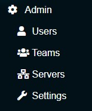
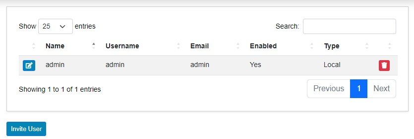
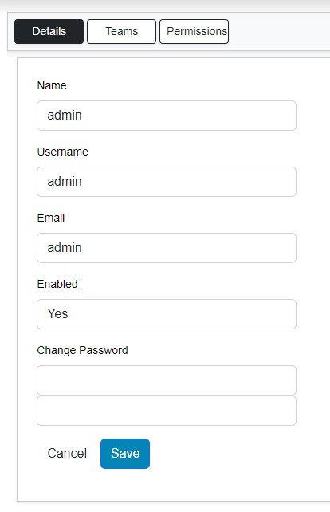

# Admin Section

The **Admin** section allows for the adjustment of administrative settings.

## Users

This menu allows for the administration of users within the system. From this menu, a user can be edited via the **Edit** button or deleted via the **Trash Can** button.

A user can be invited via email by clicking the **Invite User** button.

### Editing a User

Once the **Edit** button is clicked by a username, you are presented with the **Edit User** screen. From here, you can edit the following:

- Name
- Username
- Email address
- Set enabled state
- Change their password

## Teams

Teams in Ascender Ledger Pro are a way to group users. Permissions that are applied to a team are inherited by the members added to the team.

From the **Teams** menu, an admin can view, edit, delete, and add new teams.

### Edit Teams

When the **Edit** button is clicked beside a team name, you are presented with three tabs: **Details**, **Users**, and **Permissions**.

#### Details Tab

The **Details** tab allows for the modification of:

- Name
- Enabled status
- LDAP group DN

The LDAP information only applies when group mapping is performed via an external LDAP server.

#### Users Tab

The **Users** tab allows for adding or removing users from the team, whether they are local or LDAP users.

#### Permissions Tab

The **Permissions** tab allows for setting the permissions for the team.

## Servers

When a new Ascender or AWX derivative server begins sending log messages to Ascender Ledger Pro, an entry is automatically created in the **Servers** section. You can view the following details:

- Name
- IP address
- URL
- Trusted state

No messages will be accepted until the **Trust** button is clicked, changing the icon from a yellow unlocked padlock to a blue locked one.

The **Edit** button, when pushed, gives an administrator the ability to modify the Ascender server’s URL.

## Settings

**Settings** has three submenus: **General**, **Mail**, and **Authentication**.

### General

In the **General** settings, you can:

- Set or modify the ledger base URL.
- Enable or disable the **Remove Invocation from Changes** option, which removes invocation data that could potentially expose sensitive information.
- Set allowed fact modules. By default, this includes both `set_cmdb` and `gather_facts`.
- Modify additional retention settings (all set to 60 days by default) for:
  - Hosts
  - Facts
  - Changes
  - Packages

### Mail

Email settings can be configured from this menu. This includes:

- Disabling email sending
- Email from name
- Email from address
- SMTP server connection information

### Authentication

This section allows for the configuration of LDAP servers, which is most often utilized via Windows Active Directory (as it’s LDAP compliant).

- The **Require Group** option allows for the specification of an LDAP group that users must be a member of to connect to Ascender Ledger Pro.
- The **User Base DN** specifies where in the LDAP server to start searching for users.
