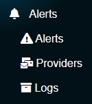
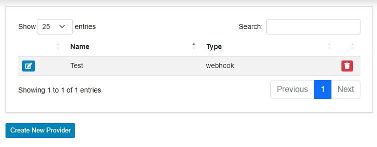
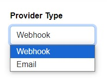
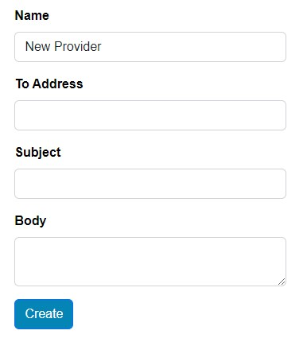
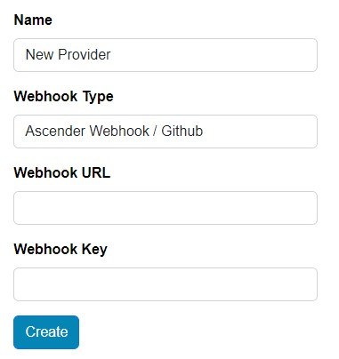
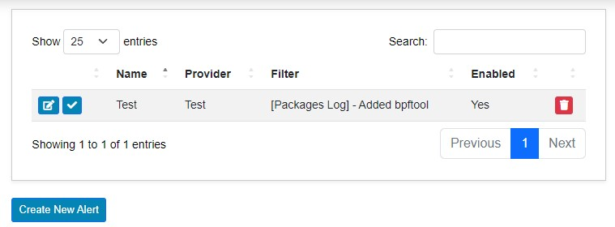
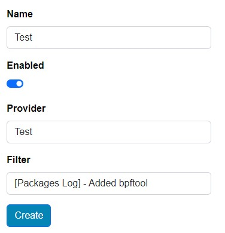
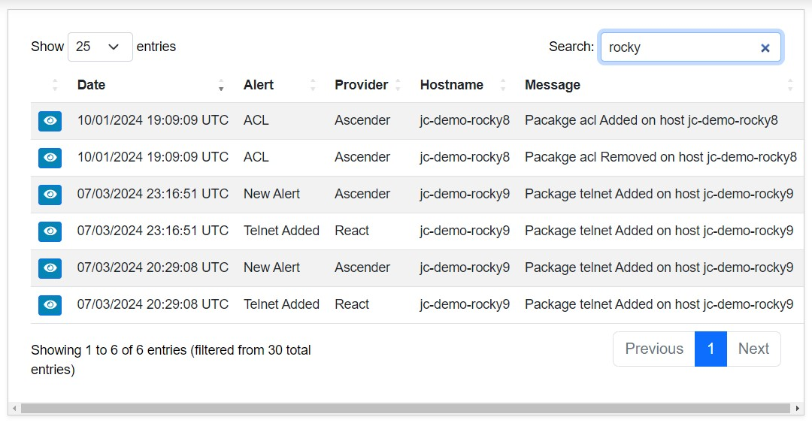
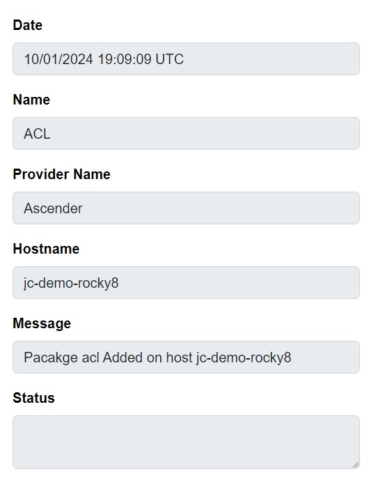

# Alerts Section

Alerts give Ascender Ledger Pro the ability to respond to incoming information. An admin configures match criteria via filters and ties them to providers, which send webhooks or emails.

## Providers

Providers can be found via the **Alerts Providers** menu. Providers are the method by which alerts are sent.

From the providers menu, you can see all currently configured providers, edit them, delete them, or create a new provider.

### Create New Provider

Clicking the **Create New Provider** button will present a provider type combo box. The options are:

- Webhook
- Email

#### Email

Choosing **Email** and clicking **Next** allows you to configure the following:

- Name for the provider
- To email address
- Email subject
- Email body

Once these fields are filled out, click **Create** to save the new provider.

##### Email Variables

Variables can be used to make the emails more flexible. They are in the format `{VARIABLE-NAME}`. Some available options are:

- `{HOST}`: Name of the host
- `{PACKAGE}`: Name of the package
- `{ACTION}`: Action performed

#### Webhook

Choosing **Webhook** and clicking **Next** allows you to configure the following:

- Name of the provider
- Webhook type
- Webhook URL
- Webhook key

##### Webhook Types

There are currently four options:

- Ascender Webhook in GitHub format
- Ascender Webhook in GitLab format
- Bare Authorization
- Normal HTTP/HTTPS

## Alerts

Alerts can be found via the **Alerts** section. This menu lists all alerts currently in the system, along with the following information:

- Name
- Provider
- Filter
- Enabled status

There are also buttons for editing, enabling or disabling, deleting an alert, or creating a new alert.

### Create an Alert

Clicking the **Create New Alert** button presents simple options:

- Name the alert
- Set enabled status
- Choose the provider
- Choose the filter

Click **Create** to save the new alert.

#### Filter

The filter combo box is populated with all filters an admin has created in various sections, such as:

- Packages log
- Changes
- Services log

## Logs

Any time an alert is triggered, an entry is added to the **Alerts Log** section. Here, you can view the following information:

- Timestamp
- Alert name
- Provider
- Hostname triggering the alert
- Alert message

There is also a **View** button next to each entry, allowing you to see greater details like the alert status.

