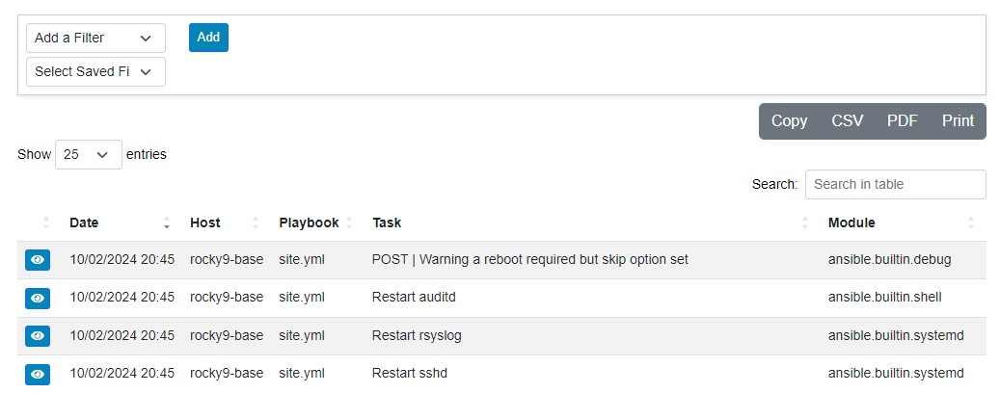
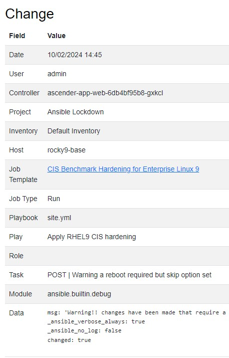
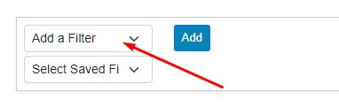
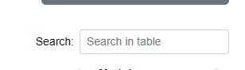
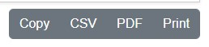

# Changes Section

Every piece of automation launched inside of Ascender or any AWX derivative has the ability to export detailed information to a logging server. For every host in each playbook task, a status is recorded. Ascender Ledger Pro collects any statuses marked as “Changed” and stores them in the database for further analysis. All of this can be found in the **Changes** section.

For all hosts, the following details are displayed:

- Timestamp
- Host name
- Playbook
- Task name
- Module

If the **View** icon is clicked, additional details about the entry will be displayed, including:

- Controller
- Project
- Inventory
- Execution environment
- Job type
- Play
- Role
- Task data

## Filtering

Filtering options include:

- Search
- Hosts
- Templates
- Playbooks
- Roles
- Modules
- Job type
- Inventory
- Project

Once a filter option is chosen, a secondary box appears. This box allows for the filter criteria to be specified. If it is a filter type that has a list associated with it (like hosts or templates), you can start typing the name of the object, and it will narrow down the list.

When choosing filter types, only a single filter type can be used at a time. For example, you can specify a single fact type or a single host. However, compound filters are allowed, such as choosing both a host and a template type simultaneously if desired.

Each filter item that is added will show up to the right of the filters list. If you navigate away from the **Changes** section and return, the filter will remain in place. Clicking the trash can icon will remove the filters.

Once a filter is added, the **Create** button can be clicked to save the item. A dialog box will pop up, prompting you to give a name to the created filter. Once completed, the saved filter will appear in the **Select Saved Filters** combo box. To use one of the saved filters, simply click the combo box and choose your option.

## Search

To the right is the **Search** box. The search box allows you to narrow down the information currently presented in the list. If no filtering is in place, it will start matching values from everything in the list. If filtering is applied, then only information from the filtered list will be found via the search box.

## Export

Exporting options exist to the right above the search box. These options include:

- **Copy**: Copies the text with tabs between the information.
- **CSV**: Downloads a CSV file.
- **PDF**: Creates a PDF version of the information.
- **Print**: Opens the print dialog box.

If filtering and/or search are utilized, the export options will only export the information currently displayed.
