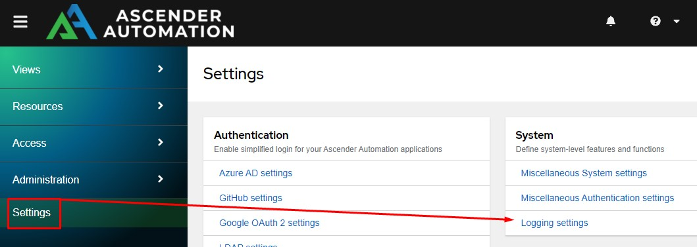
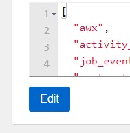
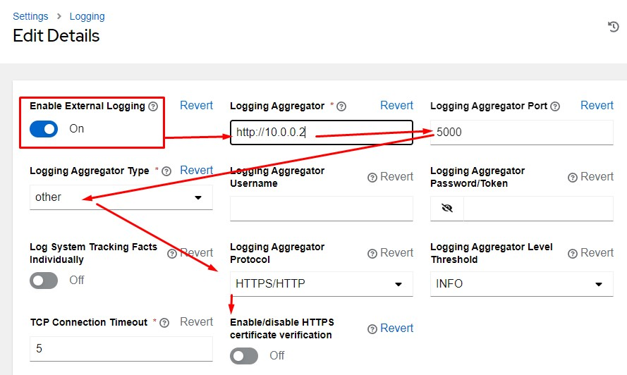

# Configuration Of Ascender

## Overview

Ascender Ledger Pro is designed to parse logs from AWX derivitives, thus each Ascender server must be configured to send its logs to ALP.

## Configure Log Export

Begin by going to *Settings* and choose *Logging Settings*:

From here click the *Edit* button at the bottom:

From here you need to make several changes:

- Logging Aggregator: http://IPorDomainNameOfALP
- Logging Aggregator Port: 5000 by default
- Logging Aggregator Type: other
- Logging Aggregator Protocol:  HTTPS/HTTP
- Enable/disable HTTPS certificate verification: Off
- Enable External Logging: On

## Configure Ascender Ledger Pro To Accept Logs

You must now enable the servers on the ALP server. Instructions are provided in the admin server section here: [Admin Servers](admin.md#servers)