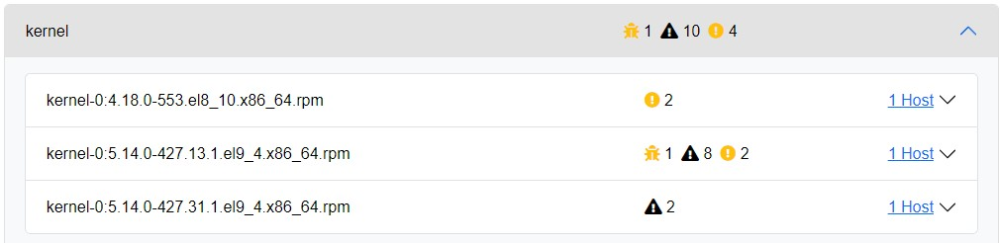

# Errata Section

Ascender Ledger Pro collects errata data for Enterprise Linux (EL) OSs. This includes RHEL, Rocky, Alma, and Oracle Linux. The errata section is built by comparing the EL Common Vulnerability and Exposures (CVE) database with the packages that are currently installed on hosts in your environment. If a package installed is not the newest version and has CVE information, it will appear in the listings.

## Charts Tab

The **Charts** tab is a visual representation of:

- Errata totals by OS
- Errata totals by severity
- The total number of hosts affected by each errata type

These graphs are customizable by clicking on entries in the key to either enable or disable them from the graphs.

## Packages Tab

Clicking the **Packages** tab provides a sorted list of all packages on any host that may have CVEs. 

Clicking on an individual package will reveal a list of affected package versions along with the hosts that each applies to. If one of the host entries is clicked, it will take you to the current packages section and apply a filter that reveals the affected host or hosts.

## CVEs Tab

The **CVEs** tab allows an administrator to quickly search for a specific CVE. When clicked, it will display the list of affected hosts.
