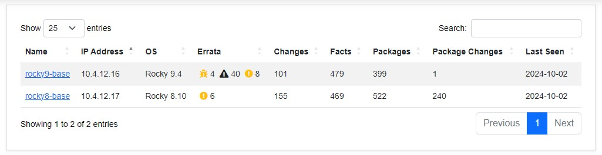
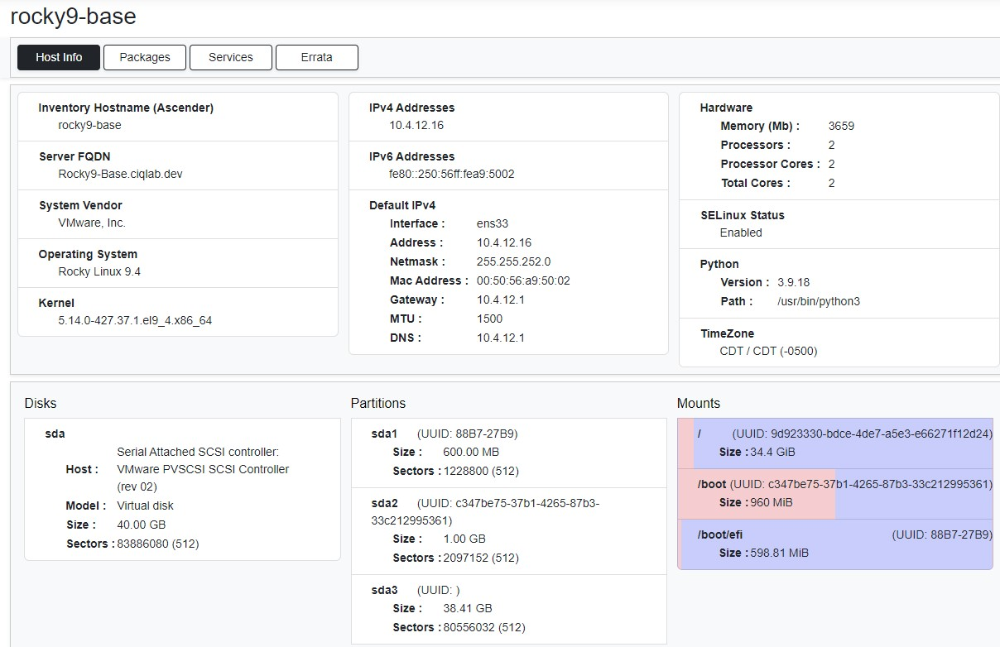
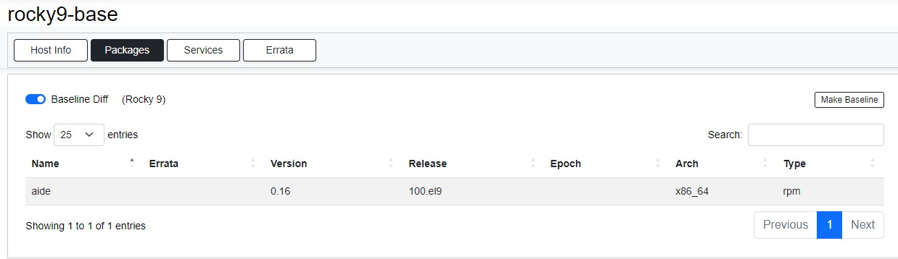
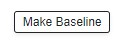
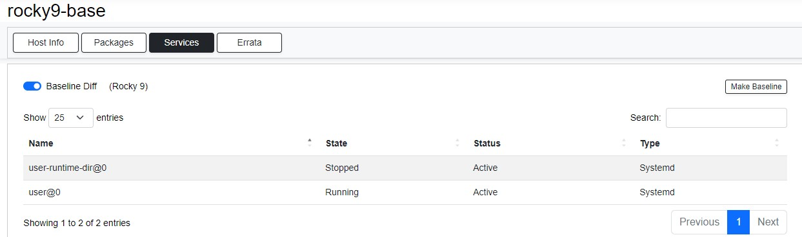
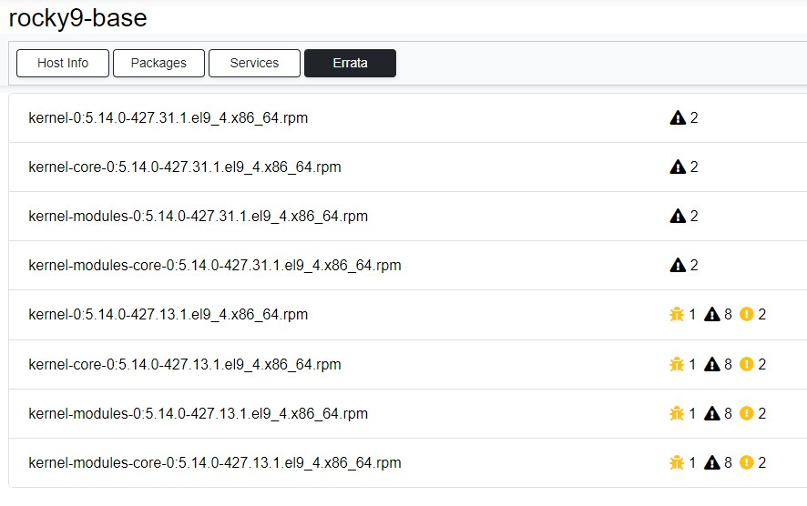

# Hosts Section

Standard gather facts, package facts, and service facts are processed for each host whose information is delivered to Ascender Ledger Pro. This information is stored in the database and can be viewed on a per-host basis by navigating to the Hosts section.

From this main screen, the following details are listed for every host that has had information collected:

- Name
- IP address
- OS
- Brief graphical errata
- Changes
- Facts
- Packages
- Packages changed
- The last time hosts were seen

## Individual Host Menu

To view information about an individual host, simply click its name.

From the host info menu, various hardware and system details can be viewed. This includes information such as:

- Discs
- Partitions
- Mounts
- Hardware
- IP addressing
- Operating system
- Kernel version

The host information screen is divided into four tabs, with **Host Info** being the default. The additional tabs are **Packages**, **Services**, and **Errata**.

### Packages Tab

To view packages specific to a host from the Hosts section, click the **Packages** tab. Here, it will list:

- Package name
- Graphical overview of any errata
- Version
- Release
- Epoch
- Arch
- Type

There is also a **Baseline Diff** button enabled by default. Baselining is the process by which a set of expected packages are associated with a host. When the Baseline Diff option is enabled, only the packages that are not part of the baseline are shown. This means that only packages above and beyond the baseline are displayed. Clicking the **Baseline Diff** radio button will disable this feature, allowing all packages to be viewed.

To the right is a **Make Baseline** button, which will use the package complement on this host as the baseline for use with other hosts in the same OS train.

### Services Tab

The **Services** tab displays the name, state, status, and type of all services on this individual host. Like the Packages tab, it utilizes baselining. By default, the **Baseline Diff** radio button is enabled, showing only the services that are not associated with this OS's baseline. To disable baselining and show all services on the system, click the **Baseline Diff** radio button.

To the right, you will also see a **Make Baseline** button. This will use the services configured on this system as the baseline for everything else in this OS code train.

### Errata Tab

To view the errata for an individual host, click the **Errata** tab. Here, all packages with associated errata information are listed. This information is derived by checking all currently installed package versions and referencing the errata database for any newer packages and their corresponding errata information. Errata may include anything from bug fixes to critical vulnerabilities.

To view more information about the displayed errata, simply click on one of the entries. The following details will be shown:

- New package information
- Advisory
- Published date
- Severity
- Supplemental information
- Links to CVE articles
