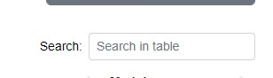
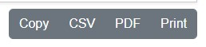

# Packages Section

Using the gather packages module from Ascender in a job template will generate detailed package information about hosts. When this information is sent to Ascender Ledger Pro, it is processed and made available in the **Packages** section.

## Packages Current

The **Current** subsection lists the known status of all packages on all hosts. The information listed here includes:

- Host
- Package name
- Errata status
- Version
- Release
- Epoch
- Arch
- Type

### Filtering

Filtering options include:

- Hosts
- Packages
- Arches

Once a filter option is chosen, a secondary box appears. This box allows for the filter criteria to be specified. If it is a filter type that has a list associated with it (like hosts or packages), you can start typing the name of the object, and it will narrow down the list.

When choosing filter types, only a single filter type may be used at a time. For example, you can specify a single fact type or a single host. However, compound filters are allowed, such as choosing both a host and a package simultaneously if desired.

Each filter item that is added will show up to the right of the filters list. If you navigate away from the **Packages** section and return, the filter will remain in place. Clicking the trash can icon will remove the filters.

Once a filter is added, the **Create** button can be clicked to save the item. A dialog box will pop up, prompting you to give a name to the created filter. Once completed, the saved filter will appear in the **Select Saved Filters** combo box. To use one of the saved filters, simply click the combo box and choose your option.

### Search

To the right is the **Search** box. The search box allows you to narrow down the information currently presented in the list. If no filtering is in place, it will match values from everything in the current list. If filtering is applied, only information from the filtered list will be found via the search box.

### Export

Exporting options exist to the right above the search box. These options include:

- **Copy**: Copies the text with tabs between the information.
- **CSV**: Downloads a CSV file.
- **PDF**: Creates a PDF version of the information.
- **Print**: Opens the print dialog box.

If filtering and/or search are utilized, the export options will only export the information currently displayed.

## Packages Log

The **Packages Log** section adds some additional functionality. Here, an **Action** option is added, which shows when a package was either added or removed from a host. This information is available whether the addition or removal happened via automation or manually by an administrator. The information is refreshed anytime a **Gather Packages** is run via Ascender.

### Filtering

Filtering options include:

- Hosts
- Packages
- Actions

Once a filter option is chosen, a secondary box appears. This box allows for the filter criteria to be specified. If it is a filter type that has a list associated with it (like hosts or packages), you can start typing the name of the object, and it will narrow down the list.

When choosing filter types, only a single filter type may be used at a time. However, compound filters are allowed, such as choosing both a host and a package simultaneously if desired.

Each filter item that is added will show up to the right of the filters list. If you navigate away from the **Packages** section and return, the filter will remain in place. Clicking the trash can icon will remove the filters.

Once a filter is added, the **Create** button can be clicked to save the item. A dialog box will pop up, prompting you to give a name to the created filter. Once completed, the saved filter will appear in the **Select Saved Filters** combo box. To use one of the saved filters, simply click the combo box and choose your option.

### Search

To the right is the **Search** box. The search box allows you to narrow down the information currently presented in the list. If no filtering is in place, it will match values from everything in the current list. If filtering is applied, only information from the filtered list will be found via the search box.

### Export

Exporting options exist to the right above the search box. These options include:

- **Copy**: Copies the text with tabs between the information.
- **CSV**: Downloads a CSV file.
- **PDF**: Creates a PDF version of the information.
- **Print**: Opens the print dialog box.

If filtering and/or search are utilized, the export options will only export the information currently displayed.
