# Reports Section

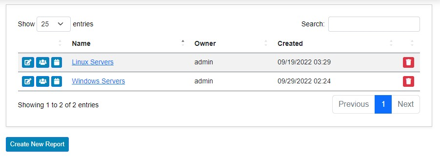

The Reports section allows an administrator to create reports based on any fact information collected. By default, there are two reports in the system: one for Linux servers and one for Windows servers. While these are quite functional, they primarily serve as examples of what can be created.

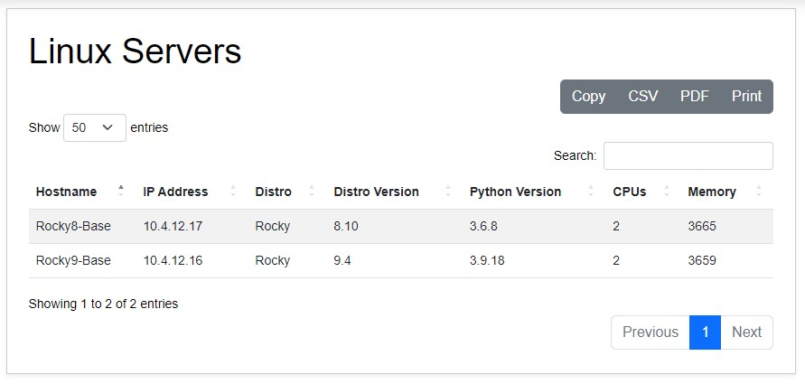

To view a report, simply click the report's name from the reports menu. In the report view, you'll see the standard search menu, as well as the ability to export via **Copy**, **CSV**, **PDF**, and **Print**.

From the main Reports interface, you can see all the listed reports that have been created, along with action buttons. These action buttons include:

- **Edit**: Allows for editing an existing report.
- **Permissions**: Allows for setting permissions on an individual report.
- **Schedule**: Allows automated scheduling of reports.
- **Delete**: Allows for the removal of reports.

## Create New Report

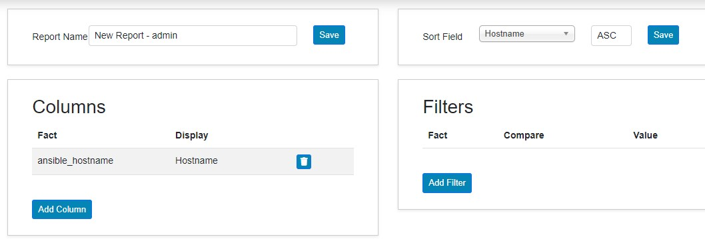

Clicking **Create New Report** from the main menu enters the New Report section. There are four sections when creating or editing a report: **Report Name**, **Sort Field**, **Columns**, and **Filters**.

- **Report Name**: Allows for setting the name of the report.
- **Sort Field**: Provides the option to choose a specific field from the columns section and how it should be sorted (ascending or descending).
- **Columns**: Allows a fact to be chosen along with a custom display name. You can also move columns up or down using the arrow buttons.
- **Filters**: Allows for choosing a specific fact to filter results with. Matching criteria include equals, not equals, greater than, less than, contains, starts with, and ends with. Compound filters are also possible.

Once the **Save** button next to the Report Name or Sort Field is clicked, all components added so far are saved to the report.

## Edit Report

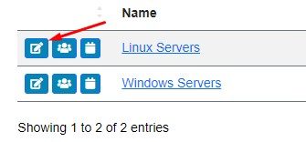

To edit a report, click the **Edit** icon. The options are the same as those in the Create New Report section above, as it has all the same configurations.

## Permissions

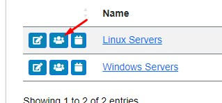

To edit permissions, click the **Permissions** button.

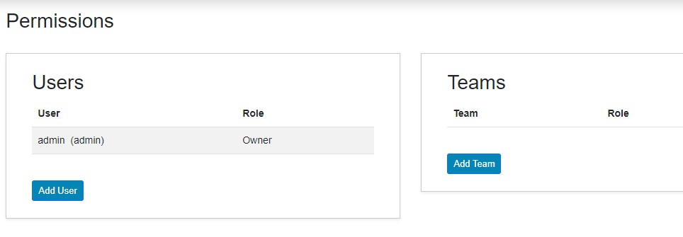

Once in the permissions screen, you are presented with two options: **Users** and **Teams**.

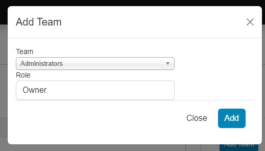

- **Teams**: Teams are groups to which you can add users. Any permissions assigned to a team will be inherited by users added to the team. Clicking on **Add Team** gives the ability to select a team from the menu and assign it a role of either viewer or editor.

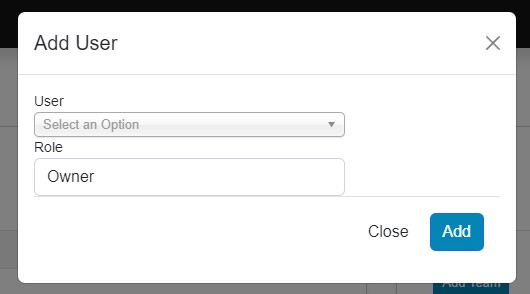

- **Users**: Users are any individual users in the system. Clicking the **Add User** button allows a username to be selected and assigned a role of viewer or editor.

## Schedules

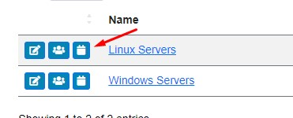

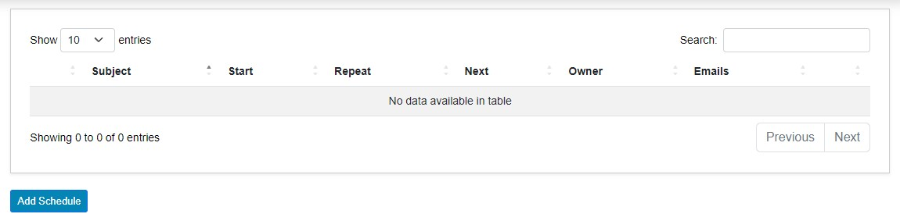

Clicking the **Schedule** button next to a report enters the schedule menu for that specific report. Here, you can view all currently created schedules.

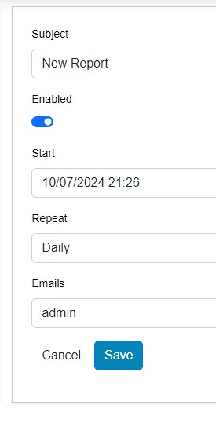

Clicking the **Add Schedule** button presents the option to create a new report schedule. In this menu, you can assign it:

- A subject name
- Designate it as enabled or not
- Set the start time and date
- Set the repeat frequency (daily, weekly, or monthly)
- Specify the emails to which the report should be sent
